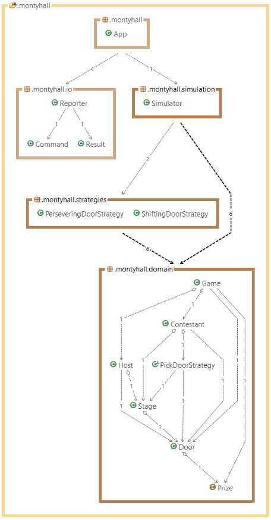
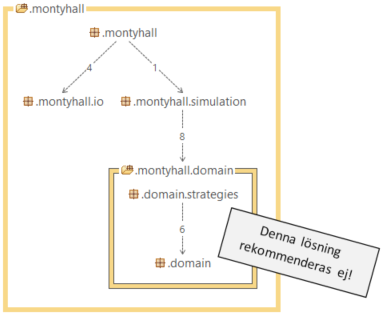
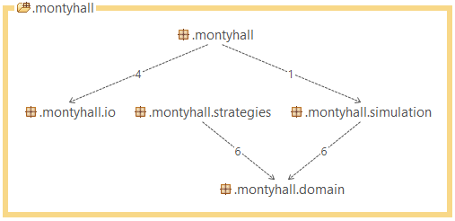

# Monty Hall - Bakgrunden till detta projekt

Detta projekt togs fram som ett av flera diskussionsunderlag till Mejslas konferensdag 2017-11-07 med tema kodkvalitet.

Själva programmet simulerar det problem som myntades i den amerikanska TV-showen *Let's Make a Deal* och brukar namnges efter showens programledare *Monty Hall*. Mer information om hela problemet finns på [Wikipedia](https://en.wikipedia.org/wiki/Monty_Hall_problem).

## Förutsättningar
Att simulera Monty Hall är egentligen ett ganska litet problem, men jag har här valt att lösa det som om det vore ett mycket större problem. Det här är alltså en i många avseenden överarbetad lösning med onödigt många klasser och paket. Syftet är att med en begränsad kodmängd kunna diskutera storskaliga problem och generella angreppsvinklar.

## OO
Jag har valt en domännära lösning med separata klasser för alla viktiga domänobjekt.

Hellre dynamisk bindning än val i villkorssatser. Jag har t.ex. valt att bryta ut beteendet för hur en `Contestant` väljer dörr till en abstrakt Strategy-klass med två konkreta subklasser. (Först provade jag faktiskt att göra en arvshierarki med två konkreta subklasser till en abstrakt `Contestant`-klass, men det var sämre på flera sätt.)

## FP
Tillståndslös programmering som mål, men inom rimliga gränser givet språket Java. T.ex. är klassen `Door` ett undantag där jag har valt att stoppa in ett par mutatorer. Skulle det ha blivit bättre om jag gjort även `Door` tillståndslös? Även `Contestant` blev muterbar efter ett par iterationer. Bättre alternativ?

Funktionellt hellre än imperativt, t.ex. strömmar istället för traditionella algol-loopar (se t.ex konstruktorn i `Stage`).
 
Hellre flera funktioner än val i villkorssatser (se t.ex. metoderna `withPerseveringBehavior()` och `withSwitchingBehavior()` i klassen `Simulator`).

Hellre högre ordningens funktioner än val i villkorsatser. Även detta hade jag ett exempel på i klassen `Simulator` där jag behövde skicka med en konstruktor som funktion, men i samband med att jag bytte ut hierarkien under `Contestant` mot en strategy-hierarki så kunde jag istället skicka med rätt strategy (vilket ju i och för sig har stora likheter med att skicka en funktion). 

## Java
Jobba mycket tillståndslöst. Deklarera allt som går som final.

En utgång (bara en return, inga break eller continue).

Namnkonventioner: I C-världen hade jag skrivit `nDoors` snarare än `doorCount`. Funkar `ixDoor` istället för `indexOfDoor`? Fler vanliga förkortningar som någon förespråkar eller vill slippa?

Konstanter: Hårdkodade strängar och default-värden, men bara(?) i paketet `io`. Bör man bryta ut dessa till properties?

## Felhantering och robusthet
I stort sett ingen felhantering alls om man inte räknar en och annan `assert` som felhantering.

Å andra sidan ganska få risker i koden, men vad händer t.ex. om:
- `Host` har öppnat alla dörrar när `Contestant` ska välja en stängd dörr?
- `Host` ska öppna en dörr trots att alla dörrar redan är öppna?

Inga `null` någonstans, och faktiskt bara ett par `Optional`. Men en `Optional` är ett fält (`Contestant.pickedDoor`), vilket vissa avråder från (bl.a. [Brian Goetz på Stack Overflow](http://stackoverflow.com/questions/26327957/should-java-8-getters-return-optional-type/26328555#26328555)). Vad säger ni?

## Flexibilitet
Vad bör man ta höjd för när det gäller tänkbara kravändringar?
- Input/output (förstås?)
- Men i domänen då? Totala antalet dörrar? Antalet dörrar som `Host` öppnar? Antal dörrar som `Contestant` får välja?
- Vad ska vara parametriserat från början, och vad ska man bara göra det lätt att koda om till?
- Mer?

## Prestanda
Implementationen av `ShiftingContestant.reviseChoice` beror mycket av hur många dörrar och hur många möjligheter som finns. Om man säkert vet att det är exakt tre dörrar varav en är vald av `Contestant` och en är öppnad av Host så är det lätt att välja den kvarvarande dörren. Men om det kan vara fler dörrar så behöver man slumpa fram valet, och i så fall påverkas valet av algoritm mycket av hur många dörrar som finns och hur många av dessa som är stängda.

## DI
Jag försöker generellt att använda DI (Dependency Injection). Notera att jag gör detta utan att använda något DI-ramverk á la Spring eller Guice. Jag använder DI för att det ska bli ren kod som är lätt att förstå och lätt att enhetstesta.

Många av klasserna i programmet kräver en slumpgenerator som därför injiceras i ett antal konstruktorer. Ett alternativ vore att ha en applikationsglobal singleton-factory där alla som behöver kan hämta slumpgeneratorn. För- och nackdelar?

`Stage`-klassen genererar själv sina dörrar utifrån argumenten i konstruktorn istället för DI. För- och nackdelar?

Någon klass måste börja sätta ihop alla bitarna. I det här fallet är det klassen `Simulator`. Det gör att just den klassen blir svår att enhetstesta eftersom den själv skapar en flera instanser istället för att ta emot via injisering. Finns det bättre lösningar?

## S.O.L.I.D.
Robert Martin (är det väl?) har myntat SOLID-principerna där D:et står för Dependency Inversion Principle (DIP). Har ni tänkt på hur DIP, IoC (Inversion of Control), DI förhåller sig till varandra?

Hur tycker ni att SOLID står sig allmän? Är det något man ska ha koll på?

Har ni några andra principer som ni brukar följa och/eller förespråka?

## Pakethantering
Var ska main ligga?

Namnkonventioner för main-klassen? Generiskt som t.ex. `Main` eller `App`, eller specifikt som `MontyHall`?

## Beroendegraf

Här är en beroendegraf över lösningen. (Grafen genererad med STAN.)

Notera: Inga cirklar!

Men `Host` och `Contestant` beror båda på `Stage`, även om de inte beror på varandra. Problemet är att de beror på *samma* `Stage` vilket måste riggas i runtime på rätt sätt och alltså är en felkälla. Vilka alternativ finns?

Hur ser ni på denna typ av grafer? Brukar ni diskutera och designa (begränsningarna i) graferna? Hur viktigt är detta?

En intressant detalj är beroendet på de konkreta subklasserna till `PickDoorStrategy`. Min tanke i detta fall var att den abstrakta basklassen var en del av domänen men att ansvaret för att definiera konkreta strategier låg utanför domänen (ja, krystat i detta enkla fall, men tänk storskaligt så hoppas jag att ni förstår hur jag menar). Jag tror att många skulle ha valt att lägga de konkreta subklasserna i ett barnpaket till `domain`, men då skulle vi ha fått ett cirkelberoende:

Ett paket beror på sina barnpaket, men om ett barnpaket i sin tur beror på föräldrapaketet så uppstår ett cirkelberoende mellan förälder och barn och de båda paketen blir ömsesidigt knutna till varandra - jag skulle hävda att de utgör ett "gemensamt delsystem".

Jag valde istället att lägga de konkreta klasserna i ett syskonpaket `montyhall.strategies` till `montyhall.domain` på följande sätt:

  
På det sättet blir alla beroenden enkelriktade.

Synpunkter?
 
## Metrics
Har ni några favoriter? Vad säger de?
- På produktionskod?
- På tester?

## Enhetstester
Hur ser bra enhetstester ut?

Jag har t.ex. testfall med flera assert-satser. Bra eller dåligt?

Hur testa klasser i en arvshierarki? I en tidigare version hade jag två subklasser till `Contestant` och varje klass i den arvshierarkien fick sin egen testklass. Sedan ändrade jag så att det blev bara en enda `Contestant` (utan subklasser) men med en strategy-hierarki istället. Då valde jag att även enhetstesta strategy-klasserna.
Två funderingar kring detta:
1. Är det bra att spegla arvshierarkier i enhetstesterna?
2. Ska man testa både klasserna i en strategy-hierarki samt deras klientklasser?

Testning av metoder ärvda från `Object`? (Jag har ett helt gammalt ramverk för att testa `equals` och `hashCode` som jag inte använder här, men vad är best practice?)

Mockning: Jag har valt bort mockningsramverk. Är det numera best practice att ha med ett sådant?

Testa slump: Visst kan man mocka med en egen slumptalsgenerator, men hur gör man om det är en implementationsdetalj hur slumptalsgeneratorn används?

## F.I.R.S.T.
Jag nämnde SOLID ovan. FIRST är en annan uppsättning principer från Bob Martin. Jag har aldrig lärt mig de ordentligt och jag håller bara med om dem delvis. Vad tycker ni? Vilka andra bra test-principer finns det att rekommendera?

## JavaDoc
Ska man använda JavaDoc-kommentarer? Jag har valt att bara använda vanliga kommentarer (/\* istället för /\*\*) eftersom programmet 
överlag inte är tänkt som något API.

Hur noggrant ska man kommentera??

Om man använder JavaDoc, hur mycket ska man använda Javadoc-features som t.ex. `@link`? (Jag använder iblan taggar som `@return` och `@param`. Synpunkter?)?
Hur hantera risken med att kommentarer hamnar i osynk med koden? I vilken utsträckning kan man få verktygshjälp med att hålla i synk??

## Projektdokumentation
Ska det finnas en readme? Var och i vilket format? Markdown??

Är det vettigt att även beskriva designval och riktlinjer som man valt att följa (lite i stil med det här dokumentet, faktiskt)??
## Maven
Hur ser en bra pom.xml ut?

## Versionshantering
Om man lägger koden i ett repository som andra ska komma åt (t.ex. publikt på GitHub), vad bör man tänka på??

Organisation av filer? Dokumentation?

Radslut? \n snarare än \r\n

Indentering? Blankslag eller tabbar? Hur många steg?

UTF-8?
